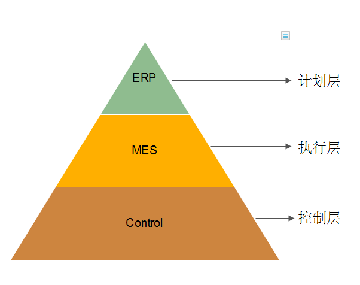

## 基于MFC的手机生产制造执行系统的设计与实现
###摘  要：

制造执行系统(Manufacturing Execution System，MES)是面向企业车间层的管理信息系统，位于计划层与控制层之间，它的主要作用是解决上层计划系统与下层控制系统之间的信息通信。企业可以通过制造执行系统获取生产实时信息、优化产能分配、提高制造效率、优化资源配置。

本文针对手机生产制造服务为主的企业特有的业务需求，详细阐述了适用于手机制造企业的制造执行系统的设计思路和实现过程。实现了用户管理、订单管理、组装生产管理、包装生产管理、品质管理等功能。企业通过导入该系统，可以确保计划层下发的生产计划得到有效的落实，并且精细化手机生产流程管理，从而为生产流程改善，提高手机质量提供保障。还为手机生产引入了条码管理体系，条码管控贯穿了主板、电池仓、彩盒包装、卡通箱包装、栈板包装整个手机生产过程，实现了物料及成品在工厂、供应商、客户、售后服务之间的流转追溯，使整个生产过程实时化、数据化。通过导入本系统，形成产品追溯体系，对产品检测、生产、出货、售后返工等整个手机生产周期中的各个因素、环节进行监控、分析、改进。实现生产过程数据化，填补了公司计划层与控制层之间的空隙，为手机生产智能化打下了夯实的基础。

本系统开发工具采用Microsoft Visual C++ 6.0、生产信息数据库使用SQL Server 2005建立、使用MFC技术进行开发。
###关键词：
制造执行系统；MES；手机生产；MFC；ZPL指令
##Design and implementation of Manufacturing Execution System for mobile phone production based on MFC
###Abstract：
Manufacturing Execution System (MES) is a management information service located between the top program management system and the underlying industrial controlled workshop. MES is committed to solving the communication between the upper planning system and the lower control system. Enterprises are able to produce real-time information to optimize the allocation of production capacity, improving manufacturing efficiency and the disposition of resource by setting up their execution system.

In view of the special business needs, the main part of which is the mobile phone production service. This article elaborates the design ideas and the implementation process of the proper MES in details. With MES, enterprises can make sure the production plan can be realized by guiding layer into execution and the production process management to be refined effectively. Both of these can provide security for the advancement of their production process and the improvement of mobile phones’ quality. In this way, enterprises can realize the functions of user management, order management, assembly management, packaging management and quality management. Moreover, this system can introduce bar-code management system to mobile phone production. Bar-code controls throughout the whole mobile phone production process include the main board, battery, color box packaging, carton packaging and pallet packaging. Thus, material and finished goods can flow fluently among factories, suppliers, customers and after-sales service, which makes the whole production process digital and real-time. By importing the system, a product trace ability system can be informed, which can monitor, analyze and improve the whole production cycle, including product testing, production, delivery and after-sale rework, etc. The digital production process filled with the vacancy between planning layer and control layer, laid a solid foundation for intellectualized production.

The system uses Microsoft Visual C ++ 6.0 as a development tool, which uses SQL Server 2005 to build production information database and MFC technology for development.
###Key words：
Manufacturing Execution System; MES; mobile phone production; MFC; ZPL command
###1 绪论
####1.1 研究背景及意义
制造业是国民经济的主体，是立国之本、兴国之器、强国之基。从十八世纪中叶工业文明开启以来，列强的兴衰史和中华名族的艰苦奋斗史一再证明，没有强大的制造业，就没有国家和名族的强盛[1]。中国要想提升综合国力、保障国家安全、建设成为世界强国就必须打造具有国际竞争力的制造业。
新中国成立尤其是改革开放以来，我国制造业发展迅速，建设了门类齐全、独立完整的产业体系，有力推动工业化和现代化进程，显著增强综合国力，支撑世界大国地位。中国制造走出国门，走向了世界，即便如此，与世界上其它制造业大国相比，中国的制造业仍然仅仅是大，不够强，没有形成强大的竞争力。中国制造在自主创新能力、资源利用率、产业链结构、信息化程度、品质效益等方面与先进水平还有差距，企业的转型升级和跨越发展的任务紧迫而又艰巨。

2015年5月8日，经李克强总理签批，国务院印发《中国制造2015》，部署全面推进实施制造强国战略[2]。这是我国实施制造强国战略的第一个十年的行动纲领。《中国制造2015》包含有五大工程，其中就有智能制造工程，提出要加快推进信息技术和制造技术的融合发展，把智能制造作为两化（工业化和信息化）深度融合的主攻方向。依托优势企业，紧扣关键工序智能化、关键岗位机器人替代、智能优化控制生产过程、优化供应链，重点领域建设数字化车间或智能工厂[3]。

制造执行系统恰好能促进智能制造工程的落实与实现。制造执行系统（Manufacturing Execution System，简称MES）是由美国AMR公司（Advanced Manufacturing Research，Inc）在上世纪九十年代提出的，随后还特地成立了制造执行系统协会（Manufacturing Execution System Association，简称MESA），以宣传制造执行系统的思想和宗旨。在AMR公司提出的企业集成的三层模型中（如图1.1），制造执行系统处于中间层，将上层的生产计划系统与工厂车间底层的设备控制系统联系起来[4]。因此，制造执行系统不只是功能单一的工厂信息管理系统，而是多位一体、横纵穿插的集成系统，填补了计划层与控制层之间的鸿沟，打通了工厂的信息交流通道，起着承上启下的关键作用。

 *图1.1 企业集成三层模型图*

(1)	计划层：企业高层决策人员使用的管理系统，突出强调计划性。

(2)	执行层：企业人员使用的管理系统，强调生产计划的控制和执行。

(3)	控制层：生产线操作人员使用，以设备控制、数据采集、监视为核心。

总结来说，制造执行系统MES重点包含一个宗旨即制造怎样执行，一个核心数据存储系统，两个用于实现与计划层和控制层通信的接口，实现计划管理、流程控制、品质管理三个重点功能。制造执行系统的实施可以为企业带来良好的经济效益，方便管理是一方面，保证质量才是重点，只有质量上去了，提高企业竞争力、延长企业生命力才会变得有可能。

####1.2 国内外研究现状
虽然制造执行系统MES的发展历史没有像MRPII,ERP,CAD/CAM等的发展历史长，但制造执行系统MES是以时间为重点的生产制造思想，为企业带来了可观的经济利益，同时也让制造执行系统在发达国家迅速发展，深深的影响了它在国外管理界人士心中的地位。近年来，中国政府通过政策鼓励制造业企业，加快智能化现代化工厂的建设，大大的增强了企业的核心竞争力，使中国制造业的水平迈上了一个新的高度，但与发达国家国家相比仍然是比上不足。单单采用高性能的自动化设备来提高制造业水平是远远不够的，提高生产信息管理系统的效率也显得尤为重要。MRPII、ERP等技术经过长时间多年的发展演变已经趋于成熟和普及，而面向制造执行层的制造执行系统MES的开发与研究还相对薄弱。中国的研究人员在车间控制层的研究重点都侧重于控制模型的研究，很少有站在制造执行系统MES这个角度从应用程序出发来研究和开发面向执行层的集成化控制软件。

在中国，许多科研院所和高等学校都在从事智能制造这方面的研究，并且联合企业开展应用程序的开发工作。结合中国制造业的特点，加入了并行、信息化、敏捷、可重构等一些先进的理论思想，采用面向对象技术、代理技术、构建技术等用于系统设计，研究成果显著，但是在把MES系统推向商品化、推广成果实际应用方面还是有很大的差距。根据《中国制造执行系统（MES）市场发展研究报告（2014版）》调查报告显示，中国制造企业对制造执行系统的投资迫切[5]。企业对MES系统投资高度重视，且金额数理较大，近三成企业的累计投资金额在500万以上；此外67%的企业对MES项目的累计投资金额超过100万。尤其是50亿以上的大型企业投入明显，52%的企业MES的累计投资超过500万；22.5亿~50亿规模的企业在各个投资区间的分布较平均；3~22.5亿规模的企业呈现“中间高、两端低”现象，投资金额集中在50万~500万间；在3亿以下规模的中小企业中，有68%的企业对MES的累计投资在200万以下[6]。MES作为新兴的市场，在中国的潜能巨大。

制造执行系统作为企业实现智能制造战略的主力，实现工厂生产敏捷化的基本技术方法，它是面向工厂执行层的生产管理系统与实时信息系统。由于制造执行系统MES注重控制与协调，使它不仅具有很好的计划性，而且能使计划得到有效的落实。因此制造执行系统在几年之间就在国外企业中迅速成长起来，并带给企业巨大的经济利益。

以MRPII/ERP为主的企业管理信息软件在我国企业实施有将近30年的历史，在业内，存在为数众多的ERP开发团队，但是这些团队中只有较少数的会向制造执行系统的方向发展，原因是：MES与工厂实际生产紧密联系，研发和实施都需要非常强的工厂自动化基础和实际生产经验，使得技术门槛较高，很多ERP团队都望而却步。但是随着市场需求和经济利益的不断加大，会有相当一部分会选择与制造企业战略合作，在3-5年后，制造制造系统MES开发团队会如雨后春笋般涌现出来，其技术和专业程度也必然日趋成熟。
####1.3 系统的主要目标
手机生产制造执行系统需能够明细手机生产的具体流程步骤，计划层下达订单生产通知书后按照实际生产需要创建出订单，并且实现订单创建信息核对和修改。需确保手机在产线生产过程中每个流程按顺序完成，每个步骤能及时检出不良品，不良品需要进行维修后再次执行返工操作，保证产品品质。实现生产信息实时监控，订单信息查询，数据导出等功能，方便工厂管理。系统主要功能如下：
(1)	实现管理用户基本信息，包括增加、删除、修改登录密码等；
(2)	实现订单创建、核对信息、修改和删除订单；
(3)	每个工作站工具版本控制，实现必须使用最新工具的防呆；
(4)	系统配置文件实现加密；
(5)	实现手机IMEI号、序列号读取和写入；
(6)	每个流水线工作站实现防呆，强制其按照正常流程操作，避免流水线员工误操
作；
(7)	实时生产数据查询和生产数据导出到Excel功能；
(8)	所有流水线员工输入时只能使用扫码枪输入信息，避免手动输入产生错误；
####1.4 论文的组织结构
本文根据手机生产企业生产管理现状，从实际需求出发，按照软件工程分析方法，详细阐述了制造执行系统MES的设计过程与实现方法。一共分为七个章节，每一章的内容如下：

第一章为绪论，详细分析了MES的背景和研究意义、国内外研究现状、系统要实现的主要目标以及各章节内容安排。

第二章为系统开发工具及相关技术的介绍，详细叙述了VC6.0、MFC技术、SQL Server和斑马打印机相关技术。

第三章为系统需求分析，首先根据对手机工厂的调研分析系统功能需求，然后分析系统数据画出数据流图与E-R图。

第四章为系统总体设计，把整个系统分模块分析，然后描述了系统数据库表单设计以及各表之间的关系。

第五章为系统的详细设计与实现，分析了两种体系结构的优缺点，关键技术的实现以及主要模块流程图分析，界面展示和核心代码展示。

第六章为系统测试，对系统关键功能部分进行测试分析，展示测试结果和修改方法。

第七章为对系统功能实现的总结以及对未来系统的展望。

